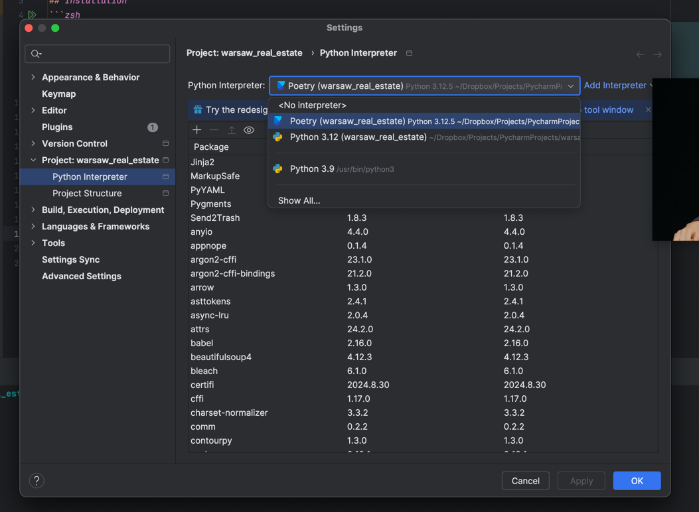

# Warsaw Real Estate Analysis 101

## Installation
```zsh
brew install pyenv poetry # Install pyenv, poetry

pyenv install 3.12 # Install Python 3.12
pyenv local 3.12 # Enable

poetry install # Install dependencies
```

## Run
```zsh
poetry run jupyter notebook  
```

## PyCharm


